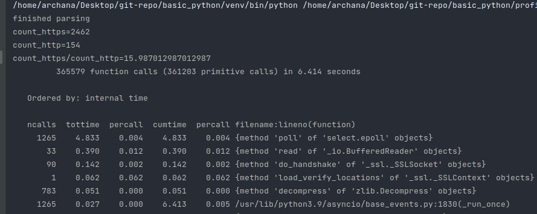

Refer below code to print the cProfile stats we can see the stats with runtime of each call in python program. 
Here the challenge will be to understand the stas as it contains too many records
https://www.youtube.com/watch?v=m_a0fN48Alw



```python

import cProfile
import pstats, asyncio

def better_count_https_in_web_pages():
    """Defined somewhere else"""
    pass


with cProfile.Profile() as pr:
    asyncio.run(better_count_https_in_web_pages())

stats = pstats.Stats(pr)
stats.sort_stats(pstats.SortKey.TIME)
stats.print_stats()
stats.dump_stats(filename='needs_profiling.prof')

```

Finally once the stats is dumped it can be read using snakeviz library by using following command
This will launch a html page with graph of different module along with time taken by it. 
```commandline
snakeviz needs_profiling.prof
```